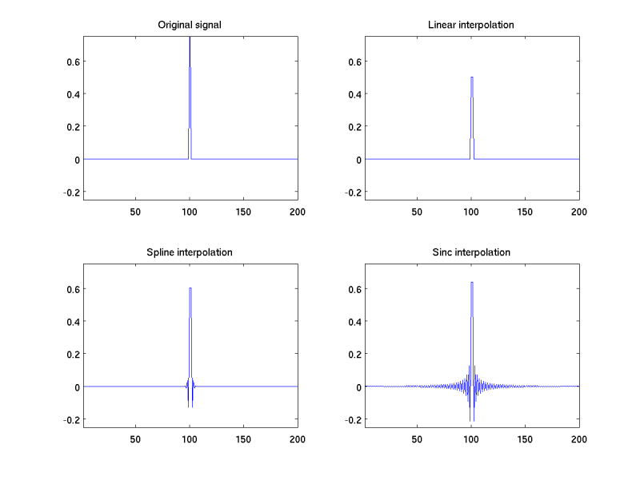
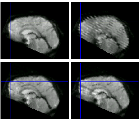
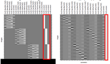

==========
 Clinic 2
==========

Artefact correction
===================

 When it comes to artifact rejection during pre-processing, what would
 you recommend doing? For example, in my data we have quite a few
 movement spikes (no real movement drifts over time). I have been
 using ArtRepair tool for this, which removes "bad" volumes and
 substitutes them with an average of the nearest "good" volumes. Do
 you think it's a reasonable approach? Are there other tools out there
 that can do similar or better artifact corrections? How much artifact
 rejection would you allow in your data before you deem the subject
 unusable?

* `artrepair <http://spnl.stanford.edu/tools/ArtRepair/ArtRepair.htm>`_
* `tsdiffana <http://imaging.mrc-cbu.cam.ac.uk/imaging/DataDiagnostics>`_
* `slice timing <http://imaging.mrc-cbu.cam.ac.uk/imaging/SliceTiming>`_
* `slice order <http://imaging.mrc-cbu.cam.ac.uk/imaging/TipsForDataAcquisition>`_
* `common artefacts <http://imaging.mrc-cbu.cam.ac.uk/imaging/CommonArtefacts>`_

This is what happens when you put a data spike through SPM's sinc
slice timing:

This is the artefact you get from large movement with interleaved
slices:

How much data do I need?
========================

   What is the minimum data that is likely to be sufficient in a block
   design? Could you expect to get results with ONE 40 second block?

* FMRI and power
* The problem of filtering

Is it worth modeling all the individual events in a block?
==========================================================

   In block-wise designs, there are often several stimuli in succession
   (e.g. a sequence of 4 angry faces). Sometimes, there is an ITI
   between the stimuli within a sequence (@100msec), sometimes the
   stimuli immediately follow one another. Is there a reason to have
   this brief ITI? In relation to this, is there more strength in an
   SPM model made with unique onset vectors for each stimulus in a
   sequence ... , or an SPM model that have one onset vector for a
   block of stimuli that begins with the first stimulus and has a
   duration of all of the stimuli in a block ...

And again:

   [We were] hearing more about pros and cons of including only a
   subset (e.g., 75%) of the events in the SPM model as opposed to
   100% of the events.

   The question came up in the context of discussing the disadvantages
   of overfitting the model with too many regressors. I guess the
   broader question this would fall under is the number of regressors
   one includes in the model, but it seems distinct enough to warrant
   some attention. I do not have a full understanding of this is done,
   but I recently heard that other labs started to model only a
   portion of their events of interest and their results were much
   cleaner that way.

* Event regressors, timing, and variance

Implicit baseline
=================

   Can you talk about the concept of the ‘implicit baseline’? What
   is the difference between including all of your data in your SPM
   model, and only including the data for the conditions that factor
   into the contrasts of interest? For example, suppose we have a
   blocked faces task that includes blocks of angry and neutral
   stimuli, but immediately after each block of faces, we ask subjects
   to rate their distress levels while the scanner is running (between
   each block of faces). In making a model, what happens if the
   ‘ratings’ data is included, vs. excluded in a model that
   ultimately aims to look at angry>neutral face related activation?
   Is it ideal to model every moment of data and to characterize each
   event as uniquely as possible (i.e. NOT to collapse time intervals
   across different kinds of events).

* The meaning of the regressors
* Advantages / disadvantages of implicit baseline

Can you use an ROI that is not significant for whole brain correction?
======================================================================

   A BASIC questions, can you walk us through why it is statistically
   sound/what it means to do an ROI analysis on a region for a given
   condition>baseline contrast if that region does NOT show activation
   in a multiple-comparison corrected omnibus test for that same
   condition>baseline contrast?  Is it better to do this than to
   present omnibus findings at an uncorrected threshold?

* The ROI and planned comparisons
* Guidelines for FMRI studies - [poldrack2007grf]_

How much should I model?
========================

   Is there an upper limit on the number of conditions that can be
   included in a blocked task/SPM model? Imagine a task with 13
   different conditions (e.g. facial expressions of different
   intensity and quality), with one 30 second block of each – is there
   something statistically implausible about modeling this? Is it
   weird/unstable to devise a reference function that is ‘on’ for 30
   seconds, then off for the remainder of a 8 or 9 minute block?

* Model selection

Confidence intervals and subjects
=================================

   In some of my experiments, I derive an estimate of a 95% confidence
   interval on the HRF in response to some event in my design, using a
   FIR estimate (but that's not really crucial). The CI is derived by
   bootstrapping (for example, on the voxels, each boot-sample being a
   different sample of the voxels in the ROI, but I can derive it in
   other ways as well). My question is really about combining
   confidence interval estimates. How do I go about combining the
   confidence intervals across different subjects?

* Random effects and variance

The return of collapsing sessions
=================================

   We ran an experiment in which there are 3 epi-bold runs. Prior to
   each one, the subject reads a priming paragraph. We're interested
   in how that priming paragraph affects their emotional response to
   viewing movie clips (the scanner was run during the clips).

   Would you recommend treating the scans separately (as on the left
   side) or concatenating them (as on the right side)? Or, is there a
   better way to do this.

