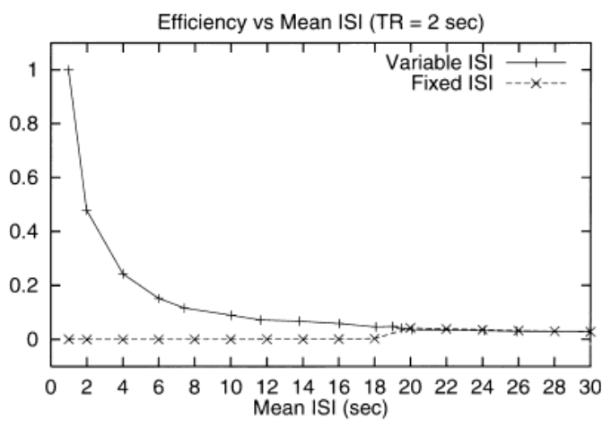
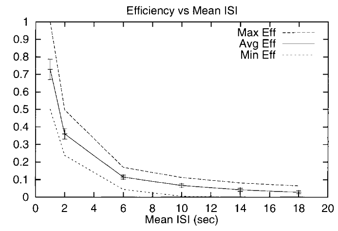
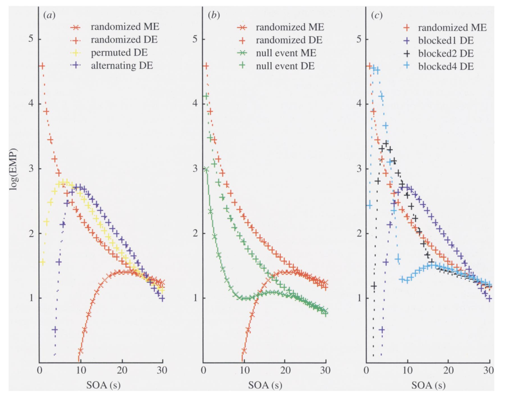

==========
 Clinic 4
==========

How to choose intervals between events?
=======================================

I have noticed great variability in ER-design ISI
intervals, in terms of ISI length and whether ISIs occur after every
stimulus or only after a certain number of stimulus presentations. Which
strategies are most effective?

AND

When jittering time intervals between successive stimuli, what is i) the
optimal range, if any? ii) what is the minimum jitter range that offers
diminished returns such that it is of no use (e.g. <=mean of 2 sec), or
is there such a number?

* Optimal experimental design for event-related fMRI. Human brain
  mapping [1065-9471] Dale (1999) volume: 8 issue: 2-3 page: 109
* Event-related functional magnetic resonance imaging: modelling,
  inference and optimization. Philosophical transactions - Royal
  Society. Biological sciences [0962-8436] Josephs (1999) volume: 354
  issue: 1387 page: 1215
* Stochastic designs in event-related fMRI. NeuroImage [1053-8119]
  Friston (1999) volume: 10 issue: 5 page: 607

How to choose and use Null trials?
==================================

Let's say you have an event-related design with 2 conditions (A and
B). Each condition has 40 trials (each lasting 8 sec), and the two
conditions have a pseudorandom order (such that A and B are never
presented more than twice in a row), which may not be optimal for
achieving a stochastic distribution of SOAs. So, we'd like to intermix
Null trials. Questions: i) How many null trials should be used (e.g. >
33% of all trials, or of the number for any one condition?), ii) how
long c/should they be (3 sec, 4 sec, 8 sec), and if they are shorter or
longer than the condition trials, does this change how frequent they
c/should be presented? iii) how should they be distributed amongst the
condition trials, and should that null trial time be jittered, iv) is
there another way around this other than Null trials?

Can parametric modulation help increasing power for parametric designs?
=======================================================================

Let's say you have a design containing a two-part trial. Part 1:
contains a visual scene of either high or low perceptual load (40 trials
high, 40 trials low), Part 2: subjects next have to make a motor
response of 1 of 4 instructed forces (weak, mild, moderate, strong),
evenly distributed across the 40/40 high/low trials). Question: For
analysis of the 4 types of motor trials (weak, mild, moderate, strong),
if you split them according to prior high or low perceptual
load/condition, you only end up with 10 events in each category = power
problem. However, could you instead model all 40 motor responses
(events) together, for each high and low perceptual load conditions, but
using parametric modulation, such that the contrast still reflects
activation corresponding to increasing force (in each of the high and
low perceptual conditions)? Is this valid? Is a range of 1-4 enough for
parametric modulation? Would you model it -2, -1, 1, 2? Is there a
better way, beyond parametric modulation, if you are constrained by this
number of trials an no more?

Voxels and millimeters in Talairach space
=========================================

I have an anatomical scan of a person and someone told me that MT is in
Talairach [43, -72, 4.3]. How would I go about finding the xyz
coordinates in my image corresponding to that person's MT? I understand
that some software packages contain this functionality, but my software
package is giving me nonsense answers.  In order to debug it, I need to
understand what it is trying to do.

* http://imaging.mrc-cbu.cam.ac.uk/imaging/MniTalairach
* https://cirl.berkeley.edu/mb312/articles/location.pdf

Overlap of activation
=====================

I'm interested in finding the overlap of activations during two
different tasks but I'm not sure what the appropriate way to test this
would be. It also seems that the level of thresholding of each map could
almost completely determine the result of this test. Does this mean that
any answer should be viewed as purely descriptive and there is no true
test statistic?

* More “mapping” in brain mapping: Statistical comparison of effects.
  Human brain mapping [1065-9471] Jernigan (2003) volume: 19 issue: 2
  page: 90
* Nichols, T., Brett, M., Andersson, J., Wager, T., Poline, J-B. (2006)
  Valid Conjunction Inference with the Minimum Statistic. NeuroImage,
  25(3):653-60
* K.J. Friston, W.D. Penny, and D.E. Glaser. Conjunction
  revisited. NeuroImage, 25(3):661-667, 2005

